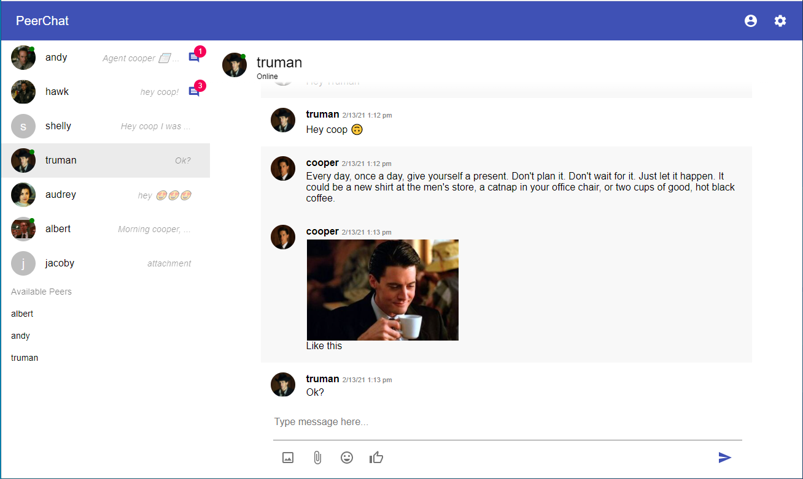
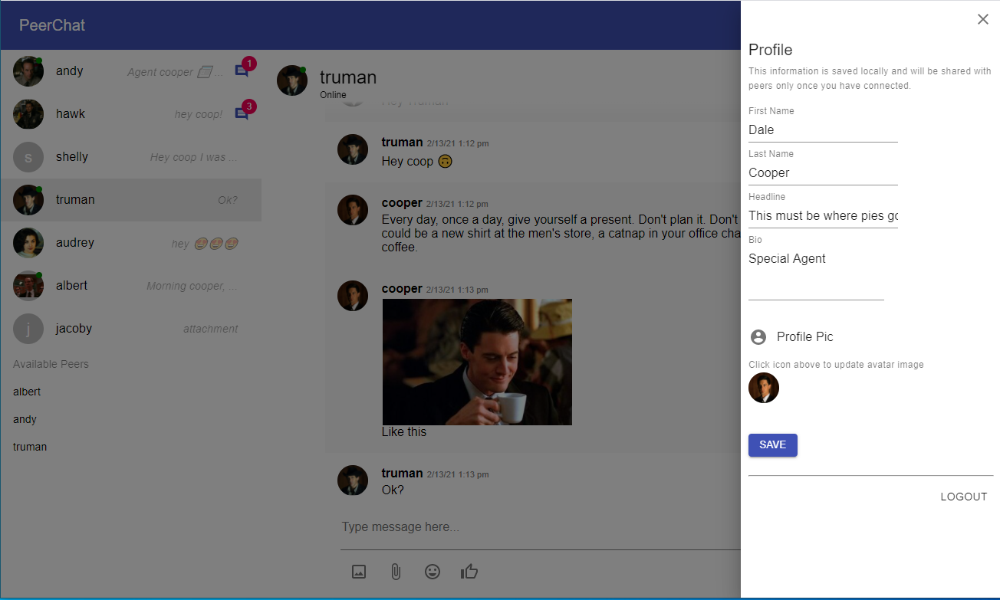
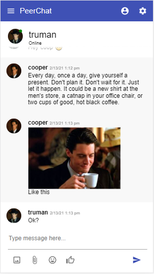
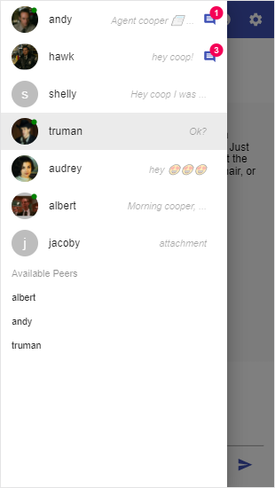

# PeerChat

## P2P chat PWA with client side data persistence.

### Features:
- Real time peer discovery and connection state observation
- Persistent conversations and connections (client side) 
- Multimedia messaging: images, attachments, emojis
- Offline messaging (messages are transmitted as soon as recipient peer is back online)
- End to end encryption of messages
- User profiles and custom settings
- Microsoft Teams-like UI
- Mobile and offline first design
- JWT authentication

  
   
  
   

---

Developed using TypeScript, React, Redux, PeerJS, Dexie, Material-UI